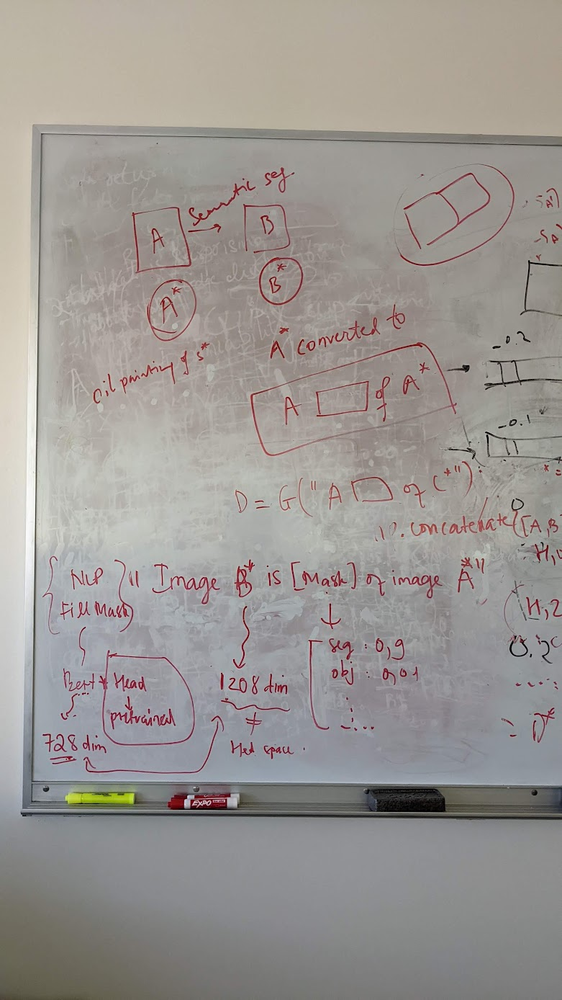

# Visual Prompt

**Papers**
- [ ] Create slide for [textual_inversion paper](https://arxiv.org/pdf/2208.01618.pdf)



Given: `A:B; C:?`. Find `D`.
Notion:
- E: Text encoder: Image generator 


```
	# Approach 1:
	Step 1: Invert A, C to A*, C*
		A* = E(A) # A = G("A photo of A*")
		C* = E(C) # C = G("A photo of C*")
	Step 2: Invert B, but conditional on A*
		B* = E(B) # B* = G("A B* of A*")
	Step 3: Generate D, using B* and A*
		D = G("A B* of C*")
```

*12/10/2022*

Got some results, but not good

- Utkarsh suggested sanity check: D = G("A B* of A*"), should return B*
- Yuheng recommended to check rescontruction noises and generation noise again. Why every reconstruction images looks exactly the same?
